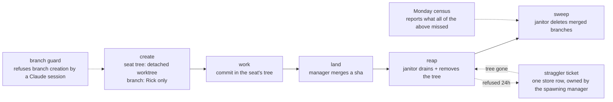

# Worktree and Branch Lifecycle (canonical workflow)

**Status**: v1.0 — written 2026-09-29, after the mechanism was built. Diagnosis and the P1–P6 plan: `src/rnd/2026.09.18-worktree-and-branch-cleanup-proposal.md` (its §4 said this document comes last).

**Purpose**: Say how git worktrees and branches are created, protected, cleaned up and audited across the three fleet repos (lupin, lupin-mobile, planning-is-prompting). **Only Rick creates branches. Seats work in detached worktrees, work lands by merging a sha, and a janitor removes what is finished.** Every rule below is a mechanism that runs, not a request to remember.

**When to use**: before creating a branch or a worktree, when a worktree or branch will not go away, when a weekly census card arrives, or when you need to get back something the janitor removed.

**Not for**: the merge-and-release ritual (`branch-pr-and-merge.md`), or freezing work (`fleet-pause-resume.md`).

---

## 1. The lifecycle

| Stage | What happens | Built in |
|---|---|---|
| **create** | A seat's tree is made with `git worktree add --detach <path> HEAD`, so it has no branch. A branch is created only by Rick, or by the reaper | `provision-seat-worktree.sh:186` (lupin), `branch-guard-reference-transaction.sh` |
| **work** | The seat commits inside its own tree | — |
| **land** | The manager merges the seat's commit sha into the working branch. The seat never makes a branch to hand work over | hook refusal message: *"the manager lands your work by merge"* |
| **reap** | Once a tree is abandoned, the janitor commits any uncommitted edits as a WIP commit, then removes the directory | `worktree_reaper.py` `drain_then_remove`, `reconcile_worktrees` |
| **sweep** | Every poll, the janitor deletes local branches that are fully merged and unused | `worktree_reaper.py` `sweep_merged_branches` |
| **audit** | Mondays 09:00 a census reports what is left, and any branch the guard never saw | `worktree_hygiene_report.py`, `branch_guard.py census` |

---

## 2. The rules, and why

| # | Rule | Why it is written down |
|---|---|---|
| 1 | **A Claude session cannot create a branch.** A `reference-transaction` hook refuses any new `refs/heads/*` when `CLAUDECODE=1`. Commits, deletes, tags and detached worktrees still work | Rick's ruling, 2026-09-29 (row `0a9b1d68`): trust **who** is asking, not what the branch is called. A name allowlist is one any worker can forge by typing a plausible `wip-v…` name |
| 2 | **`BRANCH_GUARD_ALLOW=<reason>` is the one exemption**, and it is recorded. In lupin only the reaper sets it (`=reaper`), so it can create its `wt-rescue/…` branch | Without it a detached seat's commits would have no branch to live on once its tree is removed |
| 3 | **Every branch the guard allows goes in a ledger**, `<git-common-dir>/branch-ledger.tsv`: time, who (`human`, `allow:<reason>`, or `baseline`), ref, sha. `install` first records every existing branch as `baseline`, before the hook goes live | So a branch is never both real and unrecorded. The census reads the ledger to find the ones that went around the hook |
| 4 | **The hook is self-contained POSIX `sh`** and refuses to replace a `reference-transaction` hook that is not ours | The containers run git against the same `.git`; a hook that calls a script by host path would fail there and block every commit |
| 5 | **The janitor never pushes, and never force-deletes.** It commits uncommitted work, removes the directory, and keeps the branch. It deletes a branch only with `git branch -d`, after its own ancestry check | A wrong reap must lose nothing. A merged branch loses a name, never a commit |
| 6 | **"Merged" is measured against the main tree's current branch**, using `merge-base --is-ancestor refs/heads/<name> refs/heads/<target>`, with both sides written out in full | `git branch -d` alone measures a branch against its **upstream** when it has one. And a bare name resolves to a same-named **tag** first (found by Rachel, 2026-09-18) |
| 7 | **A fresh branch is safe for 24 hours.** The sweep skips any branch younger than 24h, or whose age cannot be read | A new branch sits at the target's tip, so it reads as "merged" before anyone has committed to it |
| 8 | **Uncertainty means "leave it"**: an unreadable reflog, an unlistable worktree list, a detached main tree, or a seat whose liveness cannot be proved each keep the branch or the tree | A janitor that cannot tell must not delete |
| 9 | **The janitor never reaps a seat that might be alive.** A seat tree is locked `lupin-seat:<tmux session>`. It is reaped only when tmux says the session is absent **and** no process has its cwd inside the tree **and** it has been idle past the threshold | A live seat can sit idle past the threshold; the lock is what keeps the janitor off it |
| 10 | **Never brief a live seat to remove its own tree** | Deleting a running seat's cwd sent a reap looking for the memento in a directory that no longer existed (2026-09-18) |

---

## 3. Who may create a branch

| Who | Allowed | How it is recorded |
|---|---|---|
| **Rick, in his own terminal** (no `CLAUDECODE`) | Yes | ledger: `human` |
| **The reaper**, for the `wt-rescue/<tree>-<stamp>` branch it makes for a detached tree | Yes, via `BRANCH_GUARD_ALLOW=reaper` | ledger: `allow:reaper` |
| **Any Claude session**, manager or worker, whatever the branch is named | **No** | refused: *"Claude sessions may not create branches"* |

So a seat has no branch. It commits in a detached worktree; its manager merges the sha. If you find you need a branch, ask Rick to make it.

⚠️ **Do not try to get around the hook** (editing `.git/hooks`, `core.hooksPath`, unsetting `CLAUDECODE`). A PreToolUse guard (lupin `src/lupin_cli/claude_code/hooks/lib/branch_lock_guard.py`, row `3a592920`) denies all four routes before the command runs: setting `BRANCH_GUARD_ALLOW`, changing `core.hooksPath`, writing into the hooks directory, and unsetting or overriding `CLAUDECODE`. Reading about the lock stays allowed. A Claude seat has no way past the guard; if you think you need one of those routes, ask Rick. The census flags any branch the ledger does not know.

---

## 4. What the janitor removes, and what it refuses

The janitor runs on the arbiter (`make_worktree_janitor_fn`, `fleet_arbiter_loop.py`), once per poll, per repo. It is on, with a 6-hour idle threshold, over the repos `lupin, lupin-mobile, planning-is-prompting` (`lupin-app.ini`, `arbiter worktree janitor …`).

**It reaps a tree when all of these hold**: the tree is under the repo's `.claude/worktrees`, is not the main checkout, is not locked (or is a seat tree whose seat is provably gone), and its newest file is older than the threshold.

**It refuses, in the drain (`drain_then_remove`)**. Its docstring in `worktree_reaper.py` lists `ignored_files_present`, `ignored_check_failed` and `rescue_branch_failed` among the `skipped_reason` values; two more are only in the code:

| Refusal (`skipped_reason`) | Meaning |
|---|---|
| `wip_commit_failed` | Uncommitted edits could not be saved |
| `broken_or_not_a_worktree` | Git cannot operate in it; the janitor does not `rm` such trees |

**What counts as disposable (never a blocker)**, so a refusal is about real data: the build and vendored directories and the ignored files and prefixes in the list named below, plus:
- a seat's own run output: `io/test-suite/`, `io/swe-team/`, `io/claude_code_hooks/`, `tmp/`, `.claude-session.md`
- memento records and pointers are handled by a separate memento check in the same function

The full list is `worktree_reaper.py` § "Ignored files". Only ignored entries reach this list, so a repo that tracks its lockfile is unaffected.

**Detached trees** get a rescue branch `wt-rescue/<tree-name>-<utc stamp>` and the WIP commit `WIP: auto-saved at reap <stamp>` first. A branch carrying WIP is unmerged by definition, so the sweep keeps it.

**A refusal becomes a straggler ticket.** A tree the janitor has refused for **24 hours or more** gets exactly one store row (`worktree_straggler_tickets.py`, row `747199ef`, Rick's ruling 2026-09-29):

| Field | Value |
|---|---|
| Owner and accountable | the spawning manager, read from the tree name `seat-cc-<role>-<manager>-<n>`. A tree whose name records no creator goes to `maria`, and the body says "No creator recorded" |
| Priority · status | P3 · queued |
| Dedupe | correlation key `worktree:<absolute path>`, one row per tree; an open row under the key is adopted |
| Body | the tree, its first 10 blocking files, when refusal began (marked *estimated* on a first sighting), what clears it |
| Closed | by the janitor as **dropped**, reason "worktree … absent at <ts>", once the tree is gone |

**To clear a straggler**: move any data worth keeping somewhere durable, or delete it. The next poll removes the tree and closes the row. The row is not yours to close by hand.

**The branch sweep** (`sweep_merged_branches`) is separate from tree reaping: each poll, per repo, it lists branches merged into the main tree's branch and deletes each with `git branch -d`. It skips: `main`, `master`, the current branch, any name containing `wip` in any case, any branch a worktree has checked out, and any branch under 24 hours old. It never touches a remote.

---

## 5. Getting something back

Nothing the janitor does deletes a commit. Look in this order:

| You want | Do |
|---|---|
| A branch the sweep deleted (merged) | nothing to restore: it was fully merged, so every commit is in the working branch. Recreating the name is a branch creation, so Rick's |
| Work from a reaped detached seat | the branch `wt-rescue/<tree>-<stamp>`, plus the `WIP: auto-saved at reap` commit on it |
| Work from a reaped tree with a branch | the branch itself; `git worktree add <path> <branch>` re-adds a tree |
| A branch dropped in a manual cleanup | it was tagged first: `git branch <name> salvage/<date>/<name>` restores it (e.g. `salvage/2026.09.18/<name>`) |

The 2026-09-18 manual cleanup tagged every branch it dropped before deleting it (proposal §6). Salvage tags are a manual convention of these passes, not something the janitor creates. Restoring a branch is a branch creation, so it is Rick's to run.

**The 2026-09-29 salvage pass** (lupin, decision row `495012cb`) used the same convention with the date `2026.09.29`. Three scripts sit in `$LUPIN_ROOT/io/branch-triage/`: `2026.09.29-maria-salvage.sh`, `2026.09.29-older-salvage.sh` and `2026.09.29-radio-salvage.sh`. Each one, per branch, records the tip in a receipt file, tags it `salvage/2026.09.29/<name>`, then deletes the branch. **Rick runs them himself**, because the auto-mode permission check refuses branch deletion from a Claude session. `2026.09.29-older-salvage.sh` covers the 8 unmerged branches older than a week, which Rick ruled were not worth keeping. Restore any one with `git branch <name> salvage/2026.09.29/<name>`. A branch checked out in a live seat (`rio/dc446601-part2`) was left out on purpose. `tiberius/phase2-console-pane-tests`, unlanded, is tagged and held as a tag only, to be restored when its row is built.

*State when written*: the scripts existed and 9 `salvage/2026.09.29/*` tags were present in lupin, all from Mr. Radio's own seat. The tags the three scripts create were not yet there, so whether Rick had run them is unconfirmed.

---

## 6. The Monday census

`workflow/scripts/worktree_hygiene_report.py --notify`, crontab **Mondays 09:00** (line tagged `# worktree-hygiene-report`). **Report-only: it never deletes or moves anything.** It sends **one** card, and only if it found something. Its finding kinds, clean line and exit codes are in the script's docstring. One kind is not obvious from its name: **unledgered branches**, branches the guard never saw, made by going around it. They are only reported once the guard is installed, and `wip` names are **not** skipped here, since a forged `wip-v…` is exactly the case.

The guard has its own census: `python3 workflow/scripts/branch_guard.py census --repo <path>`. Also `install` and `status`. The hook is installed today in all three repos (`status` read `current` on 2026-09-29).

---

## 7. Known holes

| Hole | State |
|---|---|
| **`git branch -m` bypasses the hook** (git 2.34): a rename makes no ref transaction, so the hook never sees the new name | Caught after the fact by the census as an unledgered branch. Pinned by `test_a_rename_slips_past_the_hook_but_not_the_census` |
| **A shell can go around a local hook** (`core.hooksPath`, editing `.git/hooks`, unsetting `CLAUDECODE`) | **Closed for accidents, 2026-09-29** (lupin `7267f7ea1`, row `3a592920`): the PreToolUse guard `branch_lock_guard.py` denies all four routes; verified live from a seat. Its threat model is accident, not evasion, because text matching cannot see through `eval`, encoded payloads or a Python subprocess that builds its own environment. The census still catches whatever gets past both layers |
| **The janitor only sees `.claude/worktrees`** | A tree made elsewhere (`pisp-wt-*` beside the repo, `/tmp`) is invisible to it; only the census's registration listing sees it |
| **The census cannot tell a live seat from an idle one** except by the lock | It skips locked trees; an unlocked tree over 48h is reported even if someone is using it |
| **Merged branches with "wip" in the name are never deleted** | By design (the numbered release lines); they are skipped by the sweep and the census |
| **The census's suggested `branch -D`** is not what the janitor runs (`-d` after the same ancestry test) | Deliberate: `-d` refuses a tracked branch merged here but not upstream |

---

## 8. Files

| Path | Role |
|---|---|
| `workflow/scripts/branch-guard-reference-transaction.sh` | the hook |
| `workflow/scripts/branch_guard.py` | `install` · `status` · `census` |
| `workflow/scripts/test_branch_guard.py` | its tests: `pytest workflow/scripts/test_branch_guard.py` |
| `workflow/scripts/worktree_hygiene_report.py` | the Monday census |
| lupin `src/cosa/agents/shared/worktree_reaper.py` | drain, reap, branch sweep, rescue branches |
| lupin `src/cosa/agents/shared/worktree_straggler_tickets.py` | straggler rows |
| lupin `src/lupin_arbiter_app/fleet_arbiter_loop.py` | `make_worktree_janitor_fn`, the per-poll caller |
| lupin commits `484470f40`, `6df8aefeb`, `7766e1013`, `e72b7f302` | the 2026-09-29 janitor changes (row `747199ef`) |

---

**Version history**: full history in `docs/version-history/worktree-lifecycle.md`.
